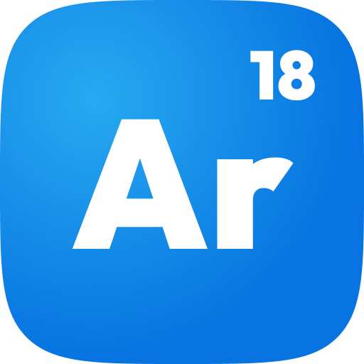



# Argon

### A simple extensible menu for Gorilla Tag mods.

# Why?
Ive found myself needing a relatively simple, lightweight menu to add stuff to, and no mod quite fulfills that need.

# API
Argon comes with a relatively simple plugin API any mod can add to, along with an example "ArgonExtensions" mod to see how the API works.
You can read docs [here](https://github.com/niko-tar-gz/Argon/blob/main/docs/MenuApi.md)

# AI Usage Guidelines
If you'd like to contribute to Argon, please refrain from writing entire PRs or large chunks of code withouut understanding what it does.
